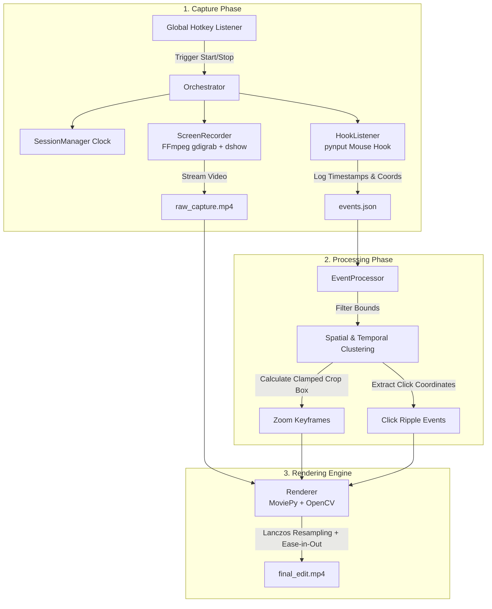

# Click2Pan 🎥🔍
### *Smart Screen Recorder with Automated Click-to-Zoom & Cinematic Panning*

[](https://www.python.org/)
[](https://www.microsoft.com/windows)
[](https://ffmpeg.org/)
[](https://opencv.org/)
[](https://github.com/TomSchimansky/CustomTkinter)

---

## 🌟 Overview

Creating video tutorials, software walk-throughs, and product demos traditionally requires hours of tedious post-production: manually setting keyframes, cropping, zooming into UI buttons, and panning across the screen.

**Click2Pan** automates your entire screen capture and post-production workflow:
1. **Records your screen & audio** via FFmpeg with zero frame drops.
2. **Tracks mouse interactions** with millisecond-accurate timeline synchronization.
3. **Automatically detects and clusters click hotspots**, calculating optimal bounding boxes.
4. **Renders smooth, cinematic pan-and-zoom sequences** with cubic easing and animated click ripple indicators.

No video editing software required — just hit record, interact with your software, stop, and get a polished presentation video ready for export.

---

## ✨ Features

- 🎯 **Intelligent Click-to-Zoom**: Automatically zooms into UI regions where you click and holds focus during interactions.
- 🧠 **Spatial & Temporal Event Clustering**: Debounces rapid clicks within spatial proximity into continuous, stable zoom windows rather than erratic camera jumps.
- 📐 **Edge-Clamped Framing**: Prevents out-of-bounds video clipping when clicking near screen corners and borders.
- 🌊 **Cinematic Pan/Zoom Transitions**: Employs cubic ease-in-out timeline interpolation (`progress * progress * (3 - 2 * progress)`) for smooth camera moves.
- 🔍 **Razor-Sharp Text Resampling**: Utilizes high-precision Lanczos-4 interpolation (`cv2.INTER_LANCZOS4`) to keep code and UI text clear and legible when enlarged.
- 🟡 **Animated Click Ripple Indicators**: Visual expanding ripple animations highlight interactions (Yellow for Left Click, Red for Right Click).
- ⏱️ **Zero-Drift Synchronization**: Thread-safe singleton session clock ensures raw video frames and mouse events match with millisecond precision.
- 🎙️ **Microphone & DirectShow Integration**: Automatic audio input discovery for voiceover narration.
- 🖥️ **Modern Dark-Mode Dashboard**: Sleek CustomTkinter interface with global hotkey support (`Ctrl+Shift+R` by default) and real-time rendering progress tracking.

---

## 🏗️ Architecture & Pipeline



---

## 📋 Prerequisites

- **Operating System**: Windows 10 / 11 (utilizes Windows `gdigrab` and `dshow`)
- **Python**: Python 3.10, 3.11, or 3.12
- **FFmpeg**: Handled automatically via `imageio-ffmpeg` (no external installation required)

---

## 🚀 Getting Started

### 1. Clone the Repository

```bash
git clone https://github.com/your-username/Click2Pan.git
cd Click2Pan
```

### 2. Create and Activate a Virtual Environment

```bash
# Using PowerShell on Windows
python -m venv venv
.\venv\Scripts\Activate.ps1

# Or using Command Prompt
.\venv\Scripts\activate.bat
```

### 3. Install Dependencies

```bash
pip install customtkinter moviepy opencv-python imageio-ffmpeg pynput numpy proglog
```

*(Alternatively, if updating `requirements.txt`):*
```bash
pip install -r requirements.txt
```

---

## 🎮 How to Use

### Step 1: Launch the Application
Run the orchestrator script:
```bash
python main.py
```

### Step 2: Configure Recording Settings
In the dashboard:
- **Select Microphone**: Choose your input device from the dropdown (or select `None (No Audio)` for silent capture).
- **Start/Stop Hotkey**: Default is `<ctrl>+<shift>+r`. Modify if desired and click **Save Settings & Register Hotkey**.

### Step 3: Record
1. Press your configured hotkey (`Ctrl+Shift+R`). The GUI will automatically hide to stay out of your capture.
2. Perform your tutorial, demo, or presentation. Click on the elements you want to highlight.
3. Press the hotkey again (`Ctrl+Shift+R`) to stop recording.

### Step 4: Automated Post-Processing
1. The dashboard reappears and displays the **Rendering Video...** progress bar.
2. The pipeline clusters clicks, calculates camera trajectories, generates ripple rings, and exports the final video.
3. Your output will be saved in `workspace/final_edit.mp4`.

---

## ⚙️ Configuration (`config.json`)

All runtime options can be customized via [config.json](file:///e:/Coding%20Tutorial/Projects/Click2Pan/config.json):

```json
{
    "video_settings": {
        "fps": 60,
        "resolution": {
            "width": 1366,
            "height": 768
        },
        "zoom_factor": 1.5
    },
    "animation_settings": {
        "zoom_duration_ms": 300,
        "hold_duration_ms": 2000,
        "debounce_threshold_ms": 1500
    },
    "paths": {
        "workspace": "./workspace",
        "raw_video": "raw_capture.mp4",
        "events_log": "events.json",
        "final_output": "final_edit.mp4"
    },
    "app_settings": {
        "hotkey": "<ctrl>+<shift>+r",
        "audio_device": ""
    }
}
```

### Key Configuration Parameters

| Parameter | Type | Description |
| :--- | :--- | :--- |
| `video_settings.fps` | Integer | Frame rate for both screen capture and final video export (default: `60`). |
| `video_settings.resolution` | Object | Target capture resolution (`width` and `height`). Match your display resolution. |
| `video_settings.zoom_factor` | Float | Zoom magnification ratio (e.g., `1.5` zooms in by 150%). |
| `animation_settings.zoom_duration_ms`| Integer | Duration of the transition zoom in / zoom out in milliseconds (default: `300`). |
| `animation_settings.hold_duration_ms`| Integer | Milliseconds to keep the zoomed camera held after the last interaction (default: `2000`). |
| `animation_settings.debounce_threshold_ms` | Integer | Time window within which consecutive clicks in proximity are clustered into one smooth zoom session (default: `1500`). |
| `paths.workspace` | String | Working directory where captures, event logs, and rendered videos are placed. |
| `app_settings.hotkey` | String | Global shortcut string recognized by `pynput` (default: `<ctrl>+<shift>+r`). |
| `app_settings.audio_device` | String | Selected DirectShow audio input device name. |

---

## 📂 Project Structure

```text
Click2Pan/
├── config.json              # Main project configuration (resolutions, timings, paths)
├── main.py                  # Application entry point and orchestrator
├── requirements.txt         # Project dependencies
├── src/
│   ├── event_processor.py   # Spatial/temporal click clustering and bounding box calculations
│   ├── gui.py               # CustomTkinter dashboard and settings controller
│   ├── hook_listener.py     # Low-level mouse event listener and logger
│   ├── recorder.py          # FFmpeg screen and audio capture wrapper
│   ├── renderer.py          # MoviePy/OpenCV rendering engine with Lanczos scaling & ripple effects
│   └── session_sync.py      # Thread-safe master clock for timeline synchronization
└── workspace/               # Generated output artifacts (raw video, logs, final render)
    ├── events.json
    ├── raw_capture.mp4
    └── final_edit.mp4
```

---

## 🛠️ Technology Stack

- **[CustomTkinter](https://customtkinter.tomschimansky.com/)**: Modern dark-themed graphical user interface.
- **[FFmpeg](https://ffmpeg.org/)** / **[imageio-ffmpeg](https://github.com/imageio/imageio-ffmpeg)**: High-speed, lossless screen (`gdigrab`) and audio (`dshow`) capture.
- **[pynput](https://github.com/moses-palmer/pynput)**: Global keyboard hotkeys and system-wide mouse hooks.
- **[MoviePy](https://zulko.github.io/moviepy/)**: Timeline composition and video transform pipeline.
- **[OpenCV (cv2)](https://opencv.org/)**: High-fidelity frame cropping, Lanczos-4 upscaling, and dynamic graphic overlays.

---

## 💡 Tips & Best Practices

1. **Display Resolution**: For the best output quality, ensure that `resolution.width` and `resolution.height` in `config.json` match your primary display resolution.
2. **Audio Setup**: If your microphone doesn't appear in the dropdown, verify that Windows microphone privacy settings allow desktop apps to access the microphone.
3. **Pacing**: Click deliberately when navigating. The clustering engine will automatically group rapid double-clicks or nearby UI interactions into a single, cohesive camera motion.

---

## 📄 License

This project is licensed under the MIT License — see the LICENSE file for details.
